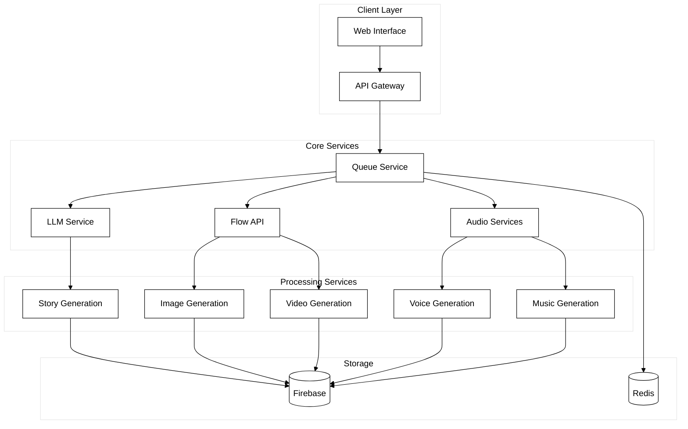
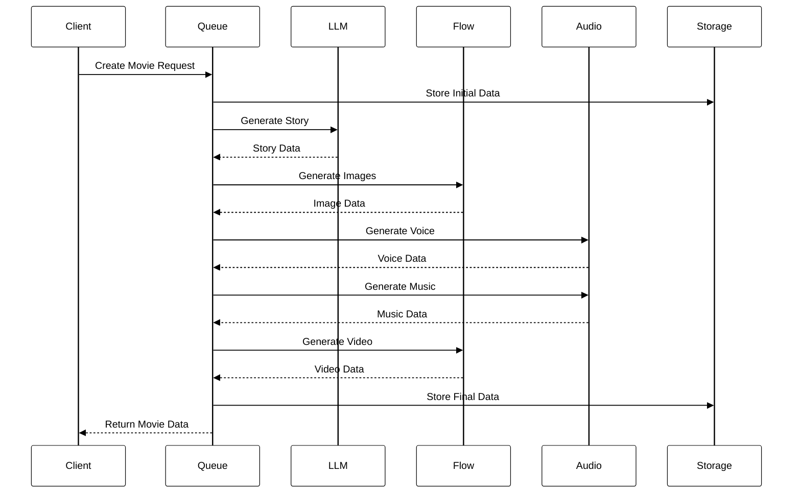
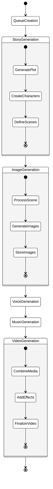
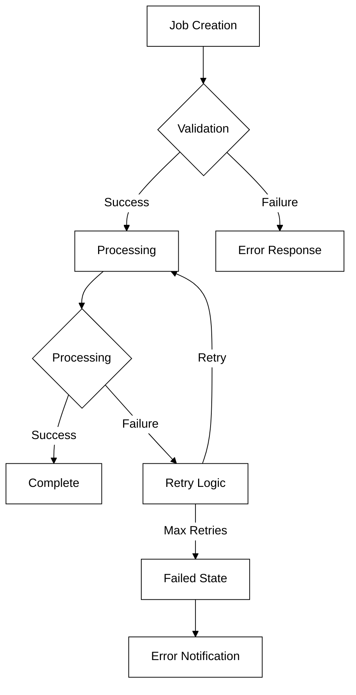

# DeepFlix - AI-Powered Movie Generation Platform

## Overview
DeepFlix is an advanced AI-powered platform that generates cinematic content through a microservices architecture. The system combines multiple AI services to create complete movies from text prompts, including story generation, image creation, voice narration, and video production.

## System Architecture

### High-Level Architecture


### Service Interaction Flow


## Core Services

### 1. Queue Service
- Manages asynchronous processing of movie generation tasks
- Coordinates workflow between services
- Handles job prioritization and error recovery
- [Detailed Documentation](docs/queue-service/README.md)

### 2. LLM Service
- Generates cinematic stories using Claude API
- Creates character descriptions and scene sequences
- Manages narrative elements
- [Detailed Documentation](docs/llm/README.md)

### 3. Flow API
- Handles image and video generation
- Integrates with ComfyUI for image creation
- Manages media processing and effects
- [Detailed Documentation](docs/flowApi/README.md)

### 4. Audio Services
- Provides text-to-speech capabilities
- Generates background music
- Manages audio processing
- [Detailed Documentation](docs/audioServices/README.md)

## API Documentation

### Queue Service API
```http
POST /api/movies
Content-Type: application/json

{
  "prompt": "string",
  "genre": "string",
  "num_sequences": number,
  "seed": number,
  "sampler": "string",
  "steps": number,
  "cfg_scale": number,
  "userId": "string"
}
```

### LLM Service API
```http
POST /generate-cinematic-story
Content-Type: application/json

{
  "genre": "string",
  "total_chunks": number,
  "previous_character": object,
  "previous_sequence": array
}
```

### Flow API
```http
POST /generateImages
Content-Type: application/json

{
  "character_data": {
    "base_traits": "string",
    "facial_features": "string",
    "clothing": "string",
    "distinctive_features": "string"
  },
  "sequence_data": [
    {
      "scene_description": "string",
      "atmosphere": "string",
      "duration": number
    }
  ],
  "generation_params": {
    "seed": number,
    "sampler": "string",
    "steps": number,
    "cfg_scale": number
  }
}
```

### Audio Service API
```http
POST /generate-voice
Content-Type: application/json

{
  "text": "string",
  "voice_id": "string",
  "model_id": "string",
  "voice_settings": {
    "stability": number,
    "similarity_boost": number
  }
}
```

## Data Flow Diagrams

### Movie Generation Process


### Error Handling Flow


## Configuration

### Environment Variables
```env
# Queue Service
PORT=3006
REDIS_URL=redis://localhost:6379
FIREBASE_CONFIG=path/to/config

# LLM Service
ANTHROPIC_API_KEY=your_key
PORT=5000

# Flow API
COMFYUI_URL=http://localhost:8188
FIREBASE_CONFIG=path/to/config
PORT=5001

# Audio Service
ELEVENLABS_API_KEY=your_key
PORT=5002
```

## Getting Started

1. **Prerequisites**
   - Node.js 16+
   - Python 3.8+
   - Redis
   - Firebase account
   - ComfyUI installation

2. **Installation**
   ```bash
   # Clone repository
   git clone https://github.com/.......git
   cd deepFlix

   # Install dependencies
   npm install
   pip install -r requirements.txt

   # Configure environment
   cp .env.example .env
   # Edit .env with your configuration
   ```

3. **Start Services**
   ```bash
   # Start Queue Service
   cd queue-service
   npm start

   # Start LLM Service
   cd llm
   python StoryGenService.py

   # Start Flow API
   cd flowApi
   python app.py

   # Start Audio Service
   cd audioServices
   python VoiceTextToSpeechAPI.py
   ```

## Monitoring and Maintenance

### Health Checks
- Queue Service: `GET /api/health`
- LLM Service: `GET /health`
- Flow API: `GET /health`
- Audio Service: `GET /health`

### Monitoring Tools
- Bull Board for queue monitoring
- Firebase Console for storage
- Custom logging system
- Performance metrics

## Security Considerations

1. **API Security**
   - Authentication required for all endpoints
   - Rate limiting implemented
   - Input validation
   - Error message sanitization

2. **Data Security**
   - Encrypted storage
   - Secure API keys
   - Access control
   - Audit logging

3. **Infrastructure Security**
   - Service isolation
   - Network security
   - Resource limits
   - Monitoring and alerts

## Contributing
Please read [CONTRIBUTING.md](CONTRIBUTING.md) for details on our code of conduct and the process for submitting pull requests.

## License
This project is licensed under the MIT License - see the [LICENSE](LICENSE) file for details.


