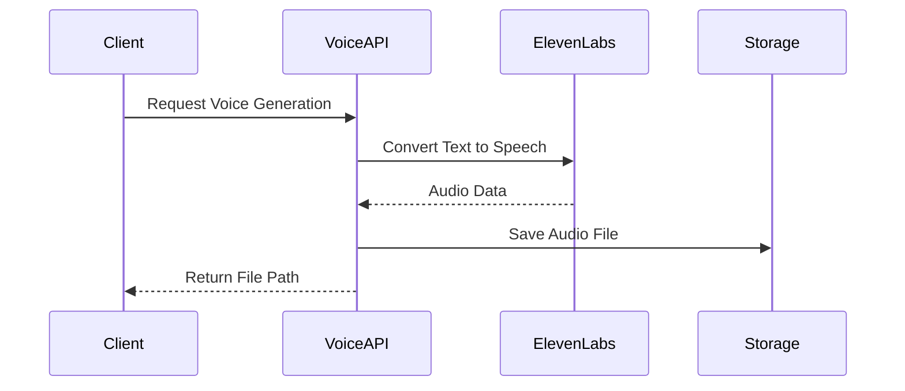

# Audio Services Documentation

## Overview
The Audio Services module provides text-to-speech capabilities using the ElevenLabs API, offering a REST API for voice generation with multiple voice options and customizable settings.

## Architecture

### Core Components
1. **Voice Text-to-Speech API** (`VoiceTextToSpeechAPI.py`)
   - Handles text-to-speech conversion
   - Manages voice selection and mapping
   - Provides voice generation endpoints
   - Integrates with ElevenLabs API

## Data Flow

## API Endpoints

### Voice Generation
- `POST /generate-voice`
  - Generates voice audio from text
  - Returns file path and status

### Voice Management
- `GET /voices`
  - Lists available voices
  - Returns voice mappings

### Health Check
- `GET /health`
  - Checks service health
  - Returns service status

## Configuration
The service requires several environment variables:

1. **Environment Variables** (`.env`)
   - `ELEVENLABS_API_KEY`: API key for ElevenLabs
   - `PORT`: Service port (default: 5010)
   - `FLASK_DEBUG`: Debug mode flag

2. **Voice Configuration**
   - Pre-configured voice mappings
   - Default voice settings
   - Model parameters

## Service Dependencies
- ElevenLabs API
- Flask
- Python-dotenv
- Logging

## Getting Started
1. Install dependencies
2. Configure environment variables
3. Start the Flask application
4. Test with health check endpoint

## Error Handling
- Input validation
- API error management
- File system error handling
- Detailed error logging

## Performance Considerations
- Streaming optimization
- File system management
- Memory usage optimization
- Error recovery 