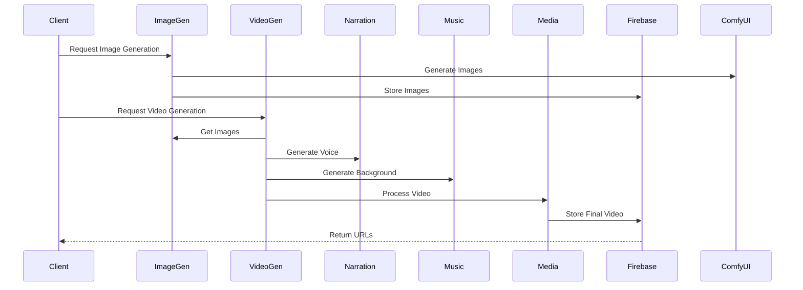

# FlowApi Documentation

## Overview
The FlowApi is a Flask-based microservice architecture that handles the generation and processing of images and videos for the DeepFlix project. It integrates multiple services including image generation, video generation, narration, music, and media processing.

## Architecture

### Core Components
1. **Image Generation Service** (`ImageGenService.py`)
   - Handles image generation using ComfyUI
   - Manages character and scene prompts
   - Integrates with Firebase for storage

2. **Video Generation Service** (`VideoGenService.py`)
   - Manages video generation from images
   - Handles video processing and effects
   - Coordinates with other services for narration and music

3. **Support Services** (`/services/`)
   - Narration Service: Text-to-speech generation
   - Music Service: Background music generation
   - Media Service: Video/audio processing
   - Firebase Service: Storage and database management

## Data Flow

## API Endpoints

### Image Generation
- `POST /generateImages`
  - Generates images based on provided prompts
  - Returns image URLs and metadata

### Video Generation
- `POST /generateVideos/<folder_id>`
  - Generates videos from images
  - Adds narration and background music
  - Returns video URL and metadata

## Configuration
The service requires several environment variables and configuration files:

1. **Environment Variables** (`.env`)
   - Firebase configuration
   - API endpoints
   - Service URLs

2. **Firebase Configuration**
   - Admin SDK credentials
   - Storage bucket settings
   - Firestore database settings

## Service Dependencies
- ComfyUI (Image/Video Generation)
- TTS API (Narration)
- Music Generation API
- FFmpeg (Media Processing)
- Firebase (Storage/Database)

## Getting Started
1. Install dependencies
2. Configure environment variables
3. Start required services (ComfyUI, TTS API, Music API)
4. Run the Flask application

## Error Handling
- Comprehensive logging system
- Error recovery mechanisms
- Timeout handling for long-running processes

## Performance Considerations
- Parallel processing where possible
- Resource management for GPU usage
- Caching mechanisms for generated content 