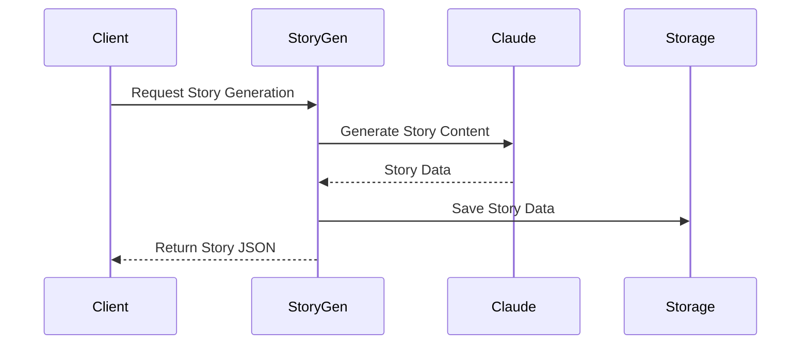

# LLM Services Documentation

## Overview
The LLM (Large Language Model) Services module provides story generation capabilities using the Anthropic Claude API, offering a REST API for generating cinematic stories with detailed character descriptions, scene sequences, and narrative elements.

## Architecture

### Core Components
1. **Story Generation Service** (`StoryGenService.py`)
   - Handles story generation using Claude API
   - Manages character and scene descriptions
   - Provides story generation endpoints
   - Integrates with Anthropic API

## Data Flow

## API Endpoints

### Story Generation
- `POST /generate-cinematic-story`
  - Generates complete story with characters and scenes
  - Returns structured story data

### Health Check
- `GET /health`
  - Checks service health
  - Returns service status

## Configuration
The service requires several environment variables:

1. **Environment Variables** (`.env`)
   - `ANTHROPIC_API_KEY`: API key for Anthropic Claude
   - `PORT`: Service port
   - `FLASK_DEBUG`: Debug mode flag

2. **Story Configuration**
   - System prompts
   - Generation parameters
   - Response formatting

## Service Dependencies
- Anthropic API
- Flask
- Python-dotenv
- Logging

## Getting Started
1. Install dependencies
2. Configure environment variables
3. Start the Flask application
4. Test with health check endpoint

## Error Handling
- Input validation
- API error management
- Response parsing
- Detailed error logging

## Performance Considerations
- Chunked story generation
- Response parsing optimization
- Memory management
- Error recovery 