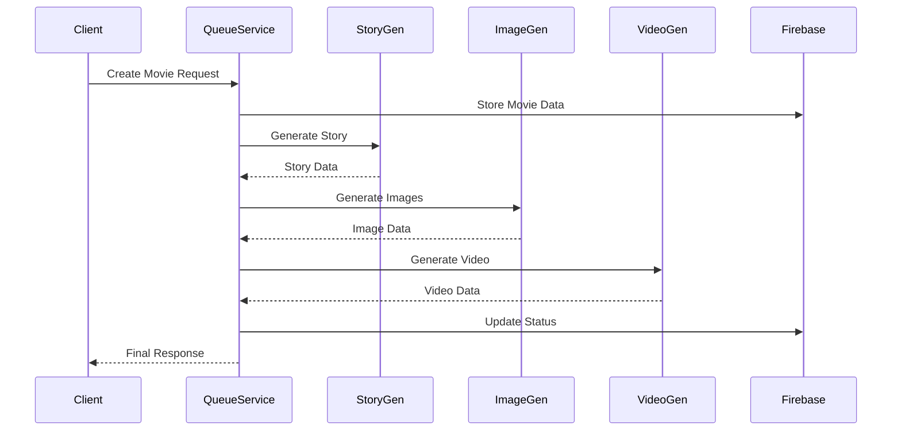

# Queue Service Documentation

## Overview
The Queue Service is a critical component of the DeepFlix system that manages the asynchronous processing of movie generation tasks. It orchestrates the workflow between story generation, image creation, and video production using a robust queue-based architecture.

## Architecture

### Core Components
1. **Queue Management**
   - Movie Creation Queue
   - Story Generation Queue
   - Image Generation Queue
   - Video Generation Queue

2. **Processors**
   - Story Processor
   - Image Processor
   - Video Processor

3. **Services**
   - Firebase Service
   - Queue Monitoring
   - Error Handling

## Data Flow

## API Endpoints

### Movie Management
- `POST /api/movies`: Create new movie generation job
- `GET /api/movies/:movieId/status`: Get movie generation status

### Queue Management
- `GET /api/queue/:jobId/position`: Get job queue position

## Configuration
The service requires several environment variables:

1. **Environment Variables** (`.env`)
   - `PORT`: Service port
   - `REDIS_URL`: Redis connection URL
   - `FIREBASE_CONFIG`: Firebase configuration
   - `NODE_ENV`: Environment mode

2. **Queue Configuration**
   - Concurrency settings
   - Retry policies
   - Timeout settings

## Service Dependencies
- Express.js
- Bull/BullMQ
- Redis
- Firebase
- CORS

## Getting Started
1. Install dependencies
2. Configure environment variables
3. Start Redis server
4. Start the service
5. Monitor queues via Bull Board

## Error Handling
- Queue job failures
- Service timeouts
- Resource exhaustion
- Firebase connection issues
- Detailed error logging

## Performance Considerations
- Queue concurrency
- Resource management
- Error recovery
- Job prioritization
- Monitoring and alerts

## Monitoring
- Bull Board dashboard
- Queue metrics
- Error tracking
- Performance monitoring
- Resource usage 